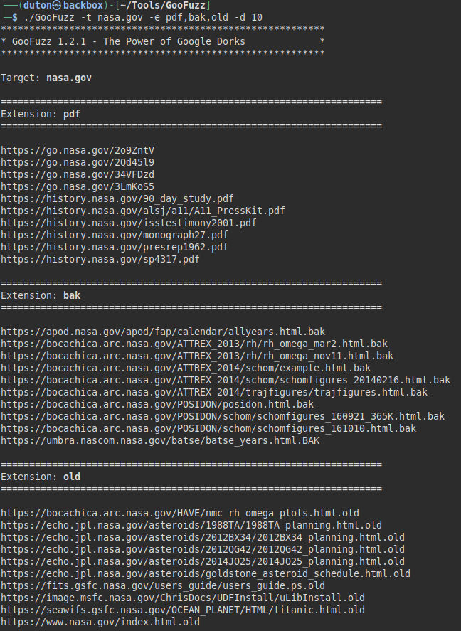
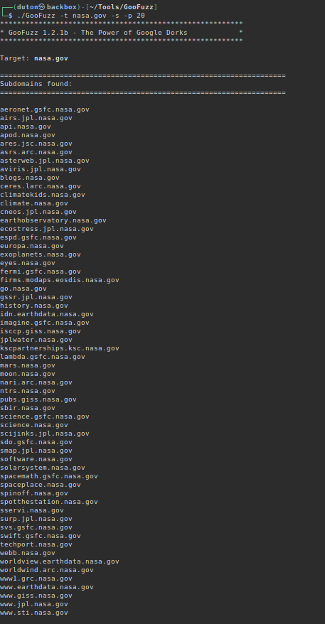
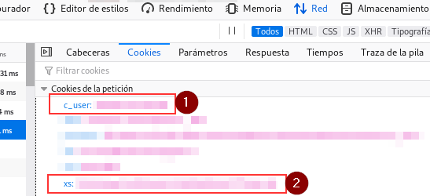

<p align="center">
  
</p>

<p align="center">
  <a href="https://github.com/m3n0sd0n4ld/GooFuzz/releases/tag/1.0">
    
  </a>
  <a href="https://www.gnu.org/licenses/gpl-3.0.en.html">
    
  </a>
  <a href="https://github.com/m3n0sd0n4ld/GooFuzz/issues?q=is%3Aissue+is%3Aopen">
    
  <a href="https://github.com/m3n0sd0n4ld/GooFuzz/commits/master">
    
  <a href="">
    
  </a>
  <br>
  <h1 align="center">GooFuzz - The Power of Google Dorks</h1>
  <br>
</p>

## Credits

###### Author: M3n0sD0n4ld
###### Twitter: [@David_Uton](https://twitter.com/David_Uton)

# Description:

**GooFuzz** is a script written in *Bash Scripting* that uses advanced Google search techniques to obtain sensitive information in files or directories without making requests to the web server.

# Download and install:
```
$ git clone https://github.com/m3n0sd0n4ld/GooFuzz.git
$ cd GooFuzz
$ chmod +x GooFuzz
$ ./GooFuzz -h
```

# Use:

## Menu


## Lists files by extensions separated by commas.


## Lists files by extensions contained in a txt file.


## Lists files by extension, either subdomain or domain and showing the first Google result.


## List files, directories and even parameters by means of a wordlist (it is recommended to use only very small files).


## Lists directories and files by specifying paths, words or file names.

  
## Exclusion of subdomains in your searches (separated by commas or by a list)
### Example 1:
In this example we remove the subdomain "*mars.nasa.gov*" from the search.


### Example 2:
We perform a normal file search by three extensions and locate subdomains that we want to exclude.


We create a file called "*exclusion_list.txt*" and insert the three subdomains to exclude, we perform the same search again, but passing the list of excluded targets. 
  

 
## Subdomains enumeration
The functionality to list subdomains (parameter "-s") and in conjunction with a number of between 10 and 20 pages (parameter "-p"), it is possible to obtain a large number of subdomains of the organization.


    
## GooFuzz + Google Captcha evasion (**This is optional**)
We have used the "-b" parameter, accompanied by a file containing cookies from a Facebook account and that allows us to launch the requests through a "developers.facebook.com" functionality and evading the temporary block.


### But where do these cookies come from? 
We will have to access the Facebook with address https://www.facebook.com, we will authenticate and extract the cookies "c_user" and "xs", then we will create a file "cookies.txt" with the content and in this format: c_user=C_USER_COOKIE; xs=XS_COOKIE



### But why do you need my Facebook cookies? Where's the "trick"?
Before explaining what **GooFuzz** does underneath to perform evasion, let it be clear that this **functionality is optional** and does not affect the normal use of the tool, so if you have already used previous versions, you will not notice any change.
    
In the following image, a URL of "developers.facebook.com" is shown, where the tool is making a query to Google from a *native tool in Facebook Developer*, so the Google captcha does not affect in the same way as if you were doing it normally or from your web browser (Interesting, isn't it?). Of course, to use this Facebook Developer utility you have to be authenticated and that is where the use of cookies comes in.
    
Also add that the important thing is that while the Facebook session is not closed, cookies will remain valid, no matter how many computers with GooFuzz you are using it.


    
# Disclaimer
- I am not responsible for the misuse of the tool.
- Google Search has mechanisms to prevent abusive use or detection of suspicious activity. If at any time the tool does not show results, Google has temporarily blocked you (e.g. Captcha).
- All the information obtained is public and through Google results. 
- Logically, the searches are in Google, so it leaves no evidence in the logs of the target's server.
- And very important, if you see a file, directory, subdomain, etc... Indexed in Google, does not mean that it still exists on the server (or it does ;)).
- I am not responsible for the loss of your Facebook account.

# Useful?
If you like the tool, find it useful in your work, Bug Bounty or as a hobby, you could help me like this:
- Tell your friends and co-workers about it.
- Contribute new ideas or help me to improve it by correcting bugs from [**here**](https://github.com/m3n0sd0n4ld/GooFuzz/issues).
- How? Do you want to buy me a coffee? Thank you very much! 

<p align="left">
  <a href="https://www.paypal.com/paypalme/elmalodebatman" target="_blank">
    </img></a>
</p>
